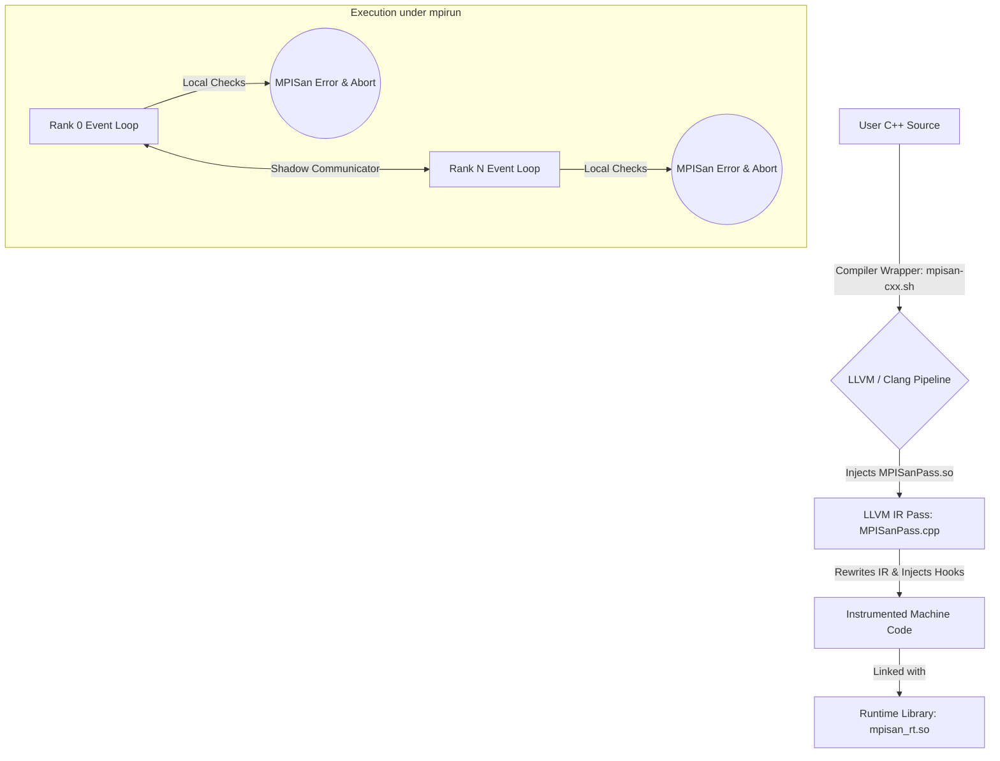
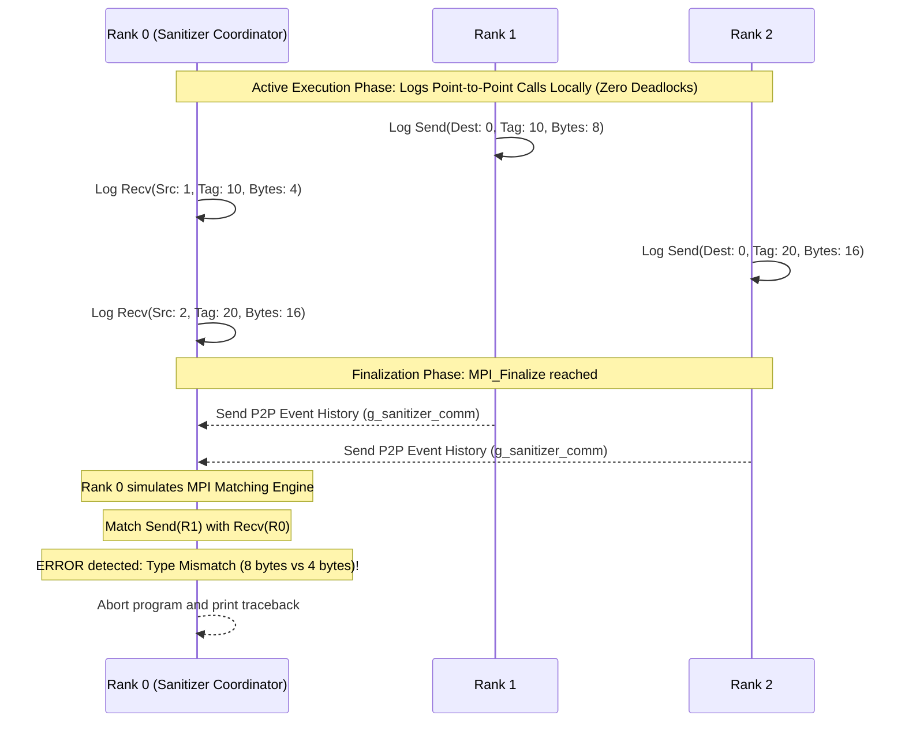

# MPISan Design & Architecture

MPISan is a **Compiler-Integrated dynamic analysis sanitizer** specifically designed to detect Message Passing Interface (MPI) programming errors at runtime. By integrating directly into the LLVM compilation pipeline, MPISan bypasses the limitations of traditional, external profiling wrappers and static analysis tools.

---

## 1. Architectural Concept

Traditional MPI debugging tools (like RWTH Aachen's **MUST**) rely purely on **PMPI wrapping** at link time. MPISan adopts a novel compiler-integrated strategy:

The system comprises two major subcomponents:
1. **The Instrumenter (LLVM Pass):** Traverses the LLVM Intermediate Representation (IR) during standard compilation to identify MPI call sites. It hooks into the parameters (buffers, counts, types, destinations) and inserts runtime tracking calls.
2. **The Validator (Runtime Library):** Executes alongside the application processes (ranks). It manages shadow memory, validates local boundaries, tracks communication history, and performs global consensus matching during `MPI_Finalize`.

---

## 2. Dynamic Point-to-Point Event Matching

Rather than executing synchronous, blocking checks that degrade performance and cause cascading deadlocks, MPISan uses a **Post-Mortem FIFO Simulation Engine**:

During finalization (`MPI_Finalize`):
- All ranks serialize and transmit their local communication histories to **Rank 0** via a duplicate **Shadow Communicator** (`g_sanitizer_comm`).
- **Rank 0** simulates the exact matching sequence of the MPI standard (handling `MPI_ANY_TAG` and `MPI_ANY_SOURCE`).
- For every matching Pair, the metadata is evaluated against:
  - **Type Mismatch:** Mismatched base types (e.g. sending `double` but receiving `int`).
  - **Buffer Overflow:** Sent payload exceeds the size of the receiver's buffer.

---

## 3. Alternative Approaches Considered

| Dimension | Static Analysis | PMPI Wrapper (MUST) | MPISan (Compiler-Integrated) |
| :--- | :--- | :--- | :--- |
| **Detection Time** | Compile time (Prone to False Positives) | Runtime (High Overhead) | **Runtime (Optimized via Compiler Pass)** |
| **Deadlock Avoidance** | Hard to prove mathematically | Uses blocking daemon ranks | **Zero active runtime blocking (Checks deferred to finalization)** |
| **Type Integrity** | Cannot see dynamic ranks/types | Loss of variable-level details | **Direct access to LLVM IR variable bounds** |
| **Performance Overhead** | Zero | High (Interception layers) | **Minimal (≈0.12s build time / <1% run time)** |
| **Integration** | Separate CLI tool | Separate runner / Java requirement | **Transparent compiler flag (`-fpass-plugin`)** |
